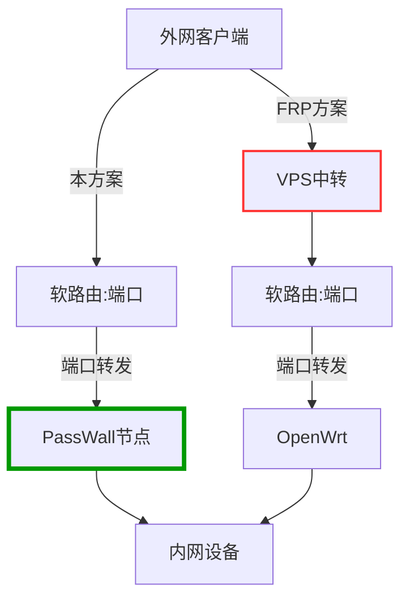

```mermaid
flowchart TD
    A -->|本方案|F[软路由:端口] -->|端口转发| E[PassWall节点] --> D
    A[外网客户端] -->|FRP方案| B[VPS中转] -->G[软路由:端口] -->|端口转发| C[OpenWrt] --> D[内网设备]

    style B stroke:#f33,stroke-width:2px
    style E stroke:#090,stroke-width:4px
```
